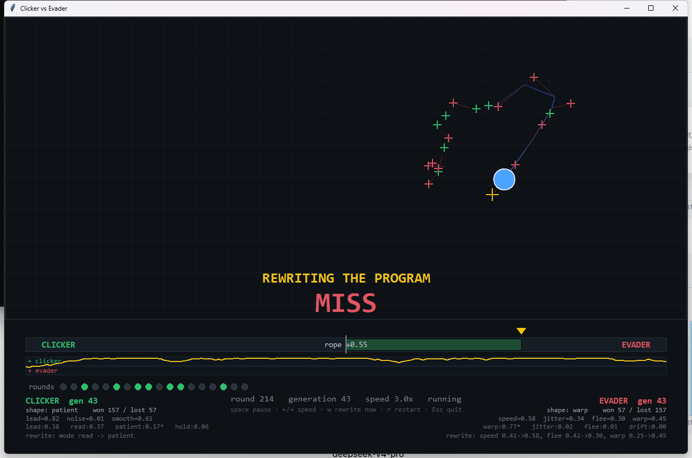
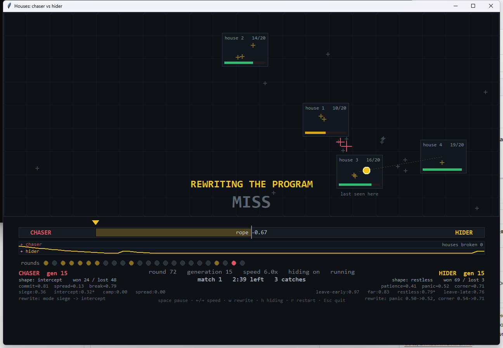

# Aiming trainer

A worked example of the practice in
[simulating-a-test.md](../../skills/create-a-skill/references/simulating-a-test.md):
a skill whose success test lives outside the machine gets a small world instead of
a sentence.

Mouse control has no command to call and no exit code. So this builds the decision
instead — a target appears, you see a picture of it, you choose a point, time
passes, and then you find out whether you were right.

```bash
python seeds.py                    # six worlds, four stages
python seeds.py --latency 5        # a slower reflex
python sim.py --sheet              # one frame per stage, for a human to look at
```

Nothing here touches your real mouse. The trainee returns a coordinate and the
world scores it, so the experiment is repeatable and does not take over the desk.

## The two halves are separate on purpose

| | |
|---|---|
| `sim.py` | draws the world, knows where the target is, and keeps score |
| `player.py` | sees only the rendered image, and knows nothing else |
| `seeds.py` | runs the same experiment over several worlds, because one is an anecdote |

`player.py` must not be able to import the answer, which is why the two files share
no state. The trainee finds the target by saturation — the background and the grid
are grey and the target is the only coloured thing — aims, and then adjusts one
number: how far ahead to aim.

## What it measured

Six independently generated worlds, 80 rounds each:

| stage | latency 1 | latency 3 | latency 5 |
|---|---|---|---|
| static | 0.946 | 0.946 | 0.946 |
| static, changing colour and shape | 0.944 | 0.944 | 0.944 |
| moving | 0.911 | 0.414 | 0.233 |
| moving, changing colour and shape | 0.908 | 0.396 | 0.208 |
| lead it settled on | 0.08 | 1.06 | 0.66 |

The trainee was never told the target's speed or the delay. It measured the gap
between where it aimed and where the target turned out to be, and moved its lead to
close it. The lead grows with the delay, which is the correct answer, reached from
evidence rather than from instruction.

The 23% at a five-tick delay is not a broken trainee. It is the honest ceiling for
anything with a reflex that slow, and a skill built on this number can say what it
is worth.

## The adversarial version: two agents, one target, a rope between them

`sim.py` measures one trainee against a world. `arena.py` makes the world fight
back. It is a fullscreen window with two agents:

| | |
|---|---|
| **Clicker** | owns the click. Scores by landing on the target. |
| **Evader** | owns the target. Scores by being somewhere else. |

Neither sees the other's decision for the round — both commit from the same
picture, which is what makes it a game rather than a demonstration. A hit pulls a
shared rope towards the clicker, a miss towards the evader, and the rope is drawn
over time as well as in the moment: one position says who is ahead this second, the
shape says whether anyone is winning, and those are different questions.

```bash
python arena.py                # fullscreen
python arena.py --windowed     # a window, for looking at
python arena.py --speed 4      # rounds per second
```

Keys: `space` pause · `←/→` speed · `w` rewrite now · `r` restart · `Esc` quit



### They rewrite their own program

Every five rounds each agent writes a new version of itself. This is not a
metaphor: real files appear in `gen/`, one per agent per generation, and the next
round runs the shape that file describes.

```
gen/
  clicker_gen42.py    MODE = 'read'      SHAPES = {lead: 0.38, read: 0.37, …}
  clicker_gen43.py    MODE = 'patient'   # mode read -> patient
  evader_gen43.py     MODE = 'warp'      # speed 0.41->0.58, warp 0.25->0.45
```

Each agent keeps a decaying score **per shape**, so the rewrite is a decision
rather than a twitch: it mostly keeps the best shape it has tried and tunes its
numbers, and occasionally tries another, because a shape that never runs cannot be
scored and the search would stall on its first idea. The scores are on screen, so
you can see *why* a rewrite happened rather than only that one did.

A run to generation 43, watched on screen:

```
CLICKER  shape: patient   won 157 / lost 57    rope +0.55
   lead:0.38   read:0.37   patient:0.17*   hold:0.06      rewrite: mode read -> patient
EVADER   shape: warp      won 57 / lost 157
   warp:0.77*  jitter:0.02 flee:0.01 drift:0.00          rewrite: speed 0.41->0.58, warp 0.25->0.45
```

The clicker came from behind to lead 157 to 57, and the screen says how: it moved
off raw prediction onto a smoothed one, twice, while the evader's only shape that
scored at all was the one that occasionally teleports.

### What the evader found on its own

Given only the last crosshair it saw, it learned to sit near a wall. That is not
in its strategy anywhere; it is a consequence of the rules — the clicker's aim is
clamped to the field, so a target in a corner cannot be aimed past, and the evader
discovered the exploit by being scored.

### The honest limit

The rewrite is bounded to a set of shapes and numbers, not free-form code
generation. A language model writing arbitrary new strategy code is the obvious
next version and would drop into the same place: `Agent.rewrite` writes a file and
the next round runs it, so a call to a model there changes nothing else in the
program. What is demonstrated here is the *loop* — score, rewrite, reload, compete
— not the sophistication of what gets written.

## The hiding game: four houses, twenty clicks each

`arena_houses.py` is the same adversarial pattern with a space to hide in. Four
houses stand, each worth twenty clicks; a click on a house is taken by the house,
never by whoever is inside; the hider is invisible while sheltered and reachable
only while crossing between houses; and a house that runs out returns at least a
hundred pixels away.

```bash
python arena_houses.py            # fullscreen
python arena_houses.py --no-hide  # draw the hider inside houses too
```



The rules are written into the hider's own generated source, so the model that
hides is literally handed the rulebook it is playing by:

```
"""Generation 33 of the Hider.

The rules it is playing by:
#   - Four houses stand, twenty clicks each.
#   - A click on a house is taken by the house, never by whoever is inside.
#   - Inside a house you cannot be seen.
#   - A house that runs out returns at least a hundred pixels away.
#   - You are visible only while travelling, and that is when a click can reach you.
#   - You may not sit in one house longer than 8 rounds; it gets too hot.
"""
```

### Six attempts to make it a game, all of them found by reading the score

| Run | Score | What was wrong |
|---|---|---|
| aim at houses | 80 – 0 | the chaser could not reach the hider at all; it never aimed at a crossing |
| add interception | 155 – 3 | the hider never *had* to move, so there were almost no crossings to intercept |
| compulsory movement | 111 – 4 | better, but seven clicks in eight still landed on open ground |
| segment interception | 110 – 5 | a crossing is a line, but the chaser was still only guessing well one time in three |
| pressure mode added | 118 – 11 | **the pressure strategy scored 0.00 and was discarded**, because the score counted catches and pressure wins nothing immediately |
| progress scored separately | **65 – 64** | a game |

The fifth row is the one worth keeping. The chaser's strategy score measured
*catches*, so the shape that grinds a house down until the hider is forced out had
no score, was never selected, and the chaser spent a hundred rounds shooting at
empty ground. **The win condition and the progress signal are different numbers**,
and scoring a strategy by the first discards every strategy whose value is delayed.

### Matches, and a slower crossing

A match lasts **three minutes**; then the round is called, the winner announced, and
a new match begins with **the same two agents**. That boundary is the point: the
strategies carry over, so a chaser that lost the first three minutes and wins the
next is the thing worth watching. The clock is on screen, and the result of the
previous match stays there.

The crossing was slowed by a third — six ticks instead of four, which was a blink
at any speed you would want to watch. What this changes is what you can *see*: the
click is resolved against the whole crossing either way, so the metric barely
moves. It is a watchability change wearing the clothes of a difficulty setting, and
saying so is cheaper than implying otherwise.

## Requirements

Python 3.9 or newer and Pillow. No numpy: the vision is channel arithmetic through
Pillow, deliberately, because the trainee should be able to see and nothing more.
